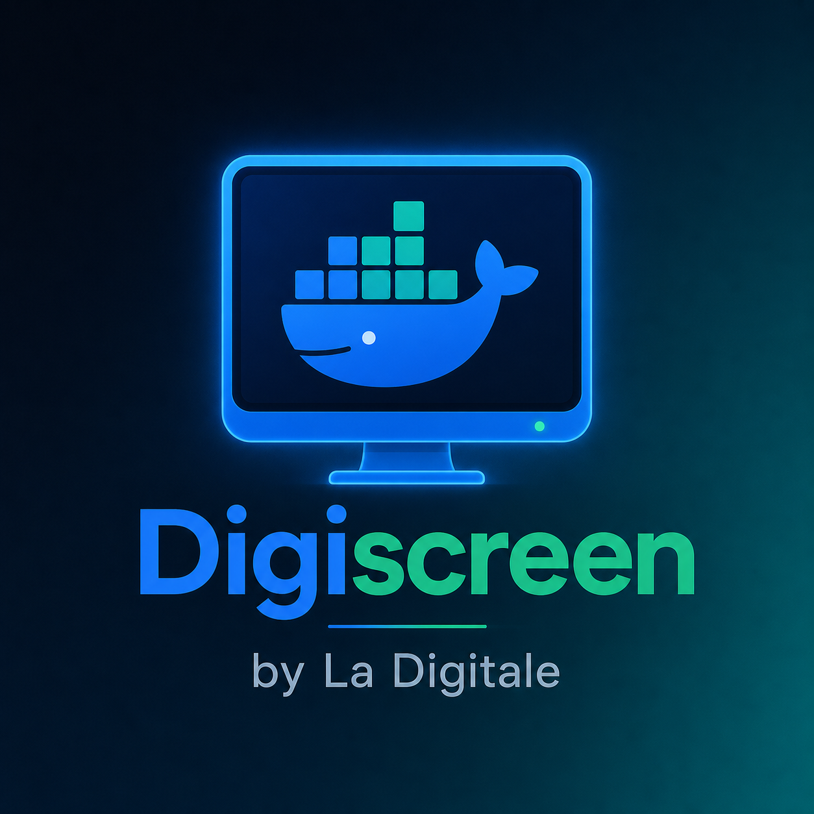

# 🖥️ Digiscreen by La Digitale – Self‑Hosted in Docker

<p align="center">
  
</p>

> Ein **ultra‑einfacher**, vollständig in Docker laufender Digiscreen‑Container auf Basis des **Ulrich‑Vollpakets** (ready‑to‑use Self‑Hosting‑Variante).
> Kein Cloud‑Zwang. Keine Datenbank. Keine nervigen Builds auf dem Server.

[](https://gitlab.eldshort.de/uivens/digiscreen)
[](https://www.docker.com/)
[](https://hub.docker.com/_/nginx)
[](https://digiscreen.medienzentrenbw.de)
[](https://github.com/jbkunama1/trt.DigiScreen)
[](https://gitlab.com/therealteacher_highfishai-group/trt-digi-screen)
[](https://jbkunama1.github.io/trt.DigiScreen/)

---

## 🎯 Features

- 🐳 **Ein Container** – Nginx + Digiscreen‑Vollpaket komplett im Image
- 🚀 **Automatisches Image‑Build** – in GitHub Actions, gepusht nach GHCR
- 🖼️ **Eigene Hintergrundbilder** – einfach in `html/assets/custom/` legen (Bind‑Mount)
- 📱 **Responsive** – optimiert für 1920px, 1024px und 860px Displays (Patch im Build)
- 🔄 **Automatische Updates** – Cron-Script oder Watchtower zieht neues GHCR-Image
- 🎛️ **Portainer‑kompatibel** – Stack-Image direkt von ghcr.io, kein lokaler Build
- 🧱 **DietPi / Debian‑ready** – weder Node.js noch Build-Tools auf dem Server nötig

---

## 📁 Projektstruktur

```text
trt.DigiScreen/
├── Dockerfile
├── docker-compose.yml        # GHCR-Image + custom-Bilder-Mount
├── nginx-custom.conf           # Nginx: Sub-Filter + Responsive-Fix
├── update_digiscreen.sh        # Pull von GHCR + Restart
├── logo_DigiScreen.png
├── .gitignore
├── LICENSE
├── CHANGELOG.md
├── .github/
│   └── workflows/
│       ├── docker-build.yml    # GHCR-Build & Push (auto)
│       └── gitlab-mirror.yml   # Mirror nach GitLab
├── html/
│   └── assets/custom/          # Eigene Hintergrundbilder (Bind-Mount)
│       ├── custom.css          # Responsive-CSS-Override
│       └── *.jpg / *.png       # Eigene Hintergrundbilder
├── docs/
│   └── index.html
└── README.md
```

---

## 🖼️ Eigene Hintergrundbilder verwenden

Hintergrundbilder sind als **Bind-Mount** in `./html/assets/custom/` ausgelagert – sie werden MOUNTED, nicht ins Image gebacken. So tauschst du sie jederzeit, ohne einen neuen Build:

```bash
# Bild (1920×1080 empfohlen) einfach in den Mount-Ordner legen
cp /pfad/zu/deinem/bild.jpg /opt/digiscreen/html/assets/custom/background.jpg

# Container neu starten (Mount wird neu gelesen)
docker compose restart
```

> 💡 Empfohlene Größe: **1920×1080 px** – skalieren:
> `mogrify -resize 1920x1080^ -gravity Center -extent 1920x1080 -quality 80 bild.jpg`

Der Mount-Ordner liegt auf dem **Server**, nicht im Repo – dadurch bleiben deine Bilder privat und ein `git pull`/Image-Update löscht sie nie. Der Docker-Volume-Mount `./html/assets/custom` bleibt dabei bestehen, auch wenn das Image neu gezogen wird.

---

## 📱 Responsive Display‑Support

Digiscreen läuft standardmäßig optimiert auf **1920×1080 px**. Über eine injizierte `custom.css` wird die Darstellung auch auf kleineren Screens korrekt skaliert:

| Auflösung | Skalierung | Einsatz |
|---|---|---|
| ≥ 1024px | 100% | Beamer, Full-HD Monitor |
| 860px – 1023px | 85% | Tablet quer, kleinere Monitore |
| ≤ 860px | 75% | Tablet hoch, Infodisplay |

Die Skalierung erfolgt automatisch via `nginx-custom.conf` + `html/assets/custom/custom.css` – das Vollpaket selbst wird nicht verändert.

---

## 📦 Schritt‑für‑Schritt‑Setup

### 1️⃣ Voraussetzungen

- Docker & Docker-Compose installiert
- Server-Zugriff (root oder docker-User)
- Docker-Compose-Datei (dieses Repo)

### 2️⃣ Repo klonen (nur Config, kein Vollpaket nötig!)

```bash
git clone https://github.com/jbkunama1/trt.DigiScreen.git /opt/digiscreen
mkdir -p /opt/digiscreen/html/assets/custom
cd /opt/digiscreen
```

> ℹ️ Das Digiscreen-Vollpaket brauchst du NICHT mehr manuell laden – es wird
> automatisch in der GitHub Actions-CI in ein GHCR-Image gebacken und von dort geholt.

### 3️⃣ Container starten (holt Image von GHCR)

```bash
docker compose up -d
# Erreichbar unter: http://SERVER_IP:8080
```

---

## 🔄 Automatische Updates (GHCR + CI)

Das Image wird **automatisch in GitHub Actions gebaut** (bei jedem Push auf `main` + wöchentlicher Schedule) und nach **ghcr.io/jbkunama1/trt.DigiScreen** gepusht.

Der Server muss also **nichts mehr bauen** – er zieht nur noch fertige Images.

```bash
# Skript auf dem Server ausführbar machen
chmod +x update_digiscreen.sh

# Wöchentlich (Sonntag 03:00) auf neuestes GHCR-Image updaten
sudo crontab -e
# 0 3 * * 0 /opt/digiscreen/update_digiscreen.sh >> /var/log/digiscreen-update.log 2>&1
```

Das Skript macht: `git pull` → `docker pull ghcr.io/…` → `docker compose up -d`.

### Optionale Alternative: Watchtower (vollautomatisch)

Watchtower zieht automatisch neue GHCR-Images, sobald sie erscheinen (kein Cron nötig):

```yaml
watchtower:
  image: containrrr/watchtower
  container_name: watchtower
  restart: unless-stopped
  volumes:
    - /var/run/docker.sock:/var/run/docker.sock
  environment:
    WATCHTOWER_CLEANUP: "true"
    WATCHTOWER_SCHEDULE: "0 0 3 * * 0"   # täglich 03:00 prüfen
  networks:
    - digiscreen_net
```

> ⚠️ Watchtower aktualisiert ALLE Container mit `watchtower` Label-Verhalten. Füge dem
> `digiscreen`-Service `watchtower.enable: "true"` als Label hinzu, falls du es steuern willst.

---

## ⚙️ Portainer‑Stack (zieht Image von GHCR)

1. **Portainer** → **Stacks** → **Add stack**
2. Name: `digiscreen`
3. `docker-compose.yml` hochladen → **Deploy the stack**

Der Stack referenziert `ghcr.io/jbkunama1/trt.DigiScreen:latest` – es wird **kein lokaler Build** gemacht, sondern das fertige Image von GHCR gezogen.

> ℹ️ **Wichtig für den ersten Pull:** Wenn du Portainer/Runner nutzt, die gegen
> `ghcr.io` keine anonymen Pulls erlauben, logge dich einmalig ein:
> `docker login ghcr.io -u <dein-gh-username>` mit einem Personal Access Token
> (Scope: `read:packages`). Für öffentliche Images ist das nur nötig, wenn du
> private Images ziehst.

---

## 🦊 GitLab Mirror

Bei jedem Push auf `main` wird automatisch ein Mirror auf GitLab Branch `github-mirror` gepusht.

🔗 [gitlab.com/therealteacher_highfishai-group/trt-digi-screen](https://gitlab.com/therealteacher_highfishai-group/trt-digi-screen)

---

## 🔗 Nützliche Links

| Ressource | Link |
|---|---|
| 🌐 Digiscreen BW | [digiscreen.medienzentrenbw.de](https://digiscreen.medienzentrenbw.de) |
| 📦 Ulrich Ivens Vollpaket | [gitlab.eldshort.de/uivens/digiscreen](https://gitlab.eldshort.de/uivens/digiscreen) |
| 📘 ZUM‑Digiscreen | [digiscreen.zum.de](https://digiscreen.zum.de) |
| 🐳 Docker Nginx Alpine | [hub.docker.com/_/nginx](https://hub.docker.com/_/nginx) |
| 🦊 GitLab Mirror | [gitlab.com/therealteacher_highfishai-group/trt-digi-screen](https://gitlab.com/therealteacher_highfishai-group/trt-digi-screen) |
| 📄 GitHub Pages | [jbkunama1.github.io/trt.DigiScreen](https://jbkunama1.github.io/trt.DigiScreen/) |

---

## 📝 Lizenz

Dieses Repository enthält nur die Docker‑/Deployment‑Konfiguration.
Das Digiscreen‑Vollpaket unterliegt der **AGPL‑v3‑Lizenz** von Ulrich Ivens / La Digitale.

---

<p align="center">
  Made with ❤️ for teachers in Baden‑Württemberg 🇩🇪<br>
  <a href="https://jbkunama1.github.io/trt.DigiScreen/">📄 Dokumentation</a>
  &nbsp;·&nbsp;
  <a href="https://gitlab.com/therealteacher_highfishai-group/trt-digi-screen">🦊 GitLab</a>
  &nbsp;·&nbsp;
  <a href="README_EN.md">🇬🇧 English</a>
</p>
